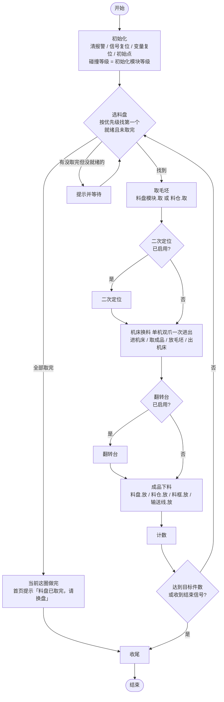
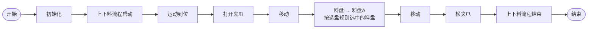

# CNC 上下料控制系统产品方案 v2

> 整理日期：2026-10-01，10-02 按 D37–D47 更新，10-04 补 D48，10-07 补 D49–D66，10-08 补 D67–D72。
> 来源：产品定稿 `plan-v2.md` 和决策记录 `decisions.md`（D1–D72），ProcessOn「软件规划9.29」，帅吕 9-30 笔记，美工的界面规范稿，测试的验收清单。
> 依据优先级：帅吕的回答 > 群里决定 > ProcessOn 9.29 > 9-30 笔记 > 技术方案 / xlsx > /cnc/ 原型。
> 技术方案见 `design/2026-09-30_CNC上下料技术方案.md`，界面原型变更见 `dev_docs/2026-09-04_上下料界面原型变更.md`。
> 本文取代 v1。文中「（Dn）」指附录 A 的决策编号。各页布局和标注以美工定稿（7 页，1280×800 和 1024×640 各一张）为准。

## 1. 范围

### 1.1 本期做

- 单机床、以双夹爪为主的上下料（D5）。
- 模块化流程：初始化 → 取毛坯 → 机床换料 → 成品下料 → 收尾。初始化只跑一次，中间三段循环，收尾在正常结束后跑一次。
- 程序和料盘都是模块，按 id 引用、带版本号（D37、D41）；工程选了料盘就自动生成主循环（D42）。
- 多工程、复制工程、新建向导、工程导入导出、工件参数和格位坐标自动计算、换产参数页、版本历史和回滚（D50–D56，见 §5.6），用来做到「快速生成」和「快速换产」。
- 上下料信号处理：料盘 / 料仓握手，夹爪信号绑定，机床联锁信号的显示。
- 碰撞等级随模块自动切换，每次切换记日志（D4）。
- 界面按 7 个菜单重做：首页、工程编辑、程序、信号、夹爪、料盘、设置（D6）。
- 目标设备：8.8–10 英寸触摸平板，只做横屏（D22）。

### 1.2 本期不做

| 项 | 说明 |
|---|---|
| 双机床 | 数据模型留扩展位，不写分支（D5） |
| 单夹爪两次进出机床 | 移到后续（D20） |
| 多夹爪一次取多个料 | 后续 |
| 按夹爪型号建模 | 不做，夹爪只配数量、信号和动作 |
| 上位机做主站直连 PLC | 设置页保留选项，标「第二阶段」（D7） |
| 上位机直连 CNC（OPC UA / FOCAS） | 第二阶段，同技术方案 |
| PO 订单 | 本期不做（D15） |

### 1.3 架构约束（沿用技术方案）

- 上位机生成整套程序、一次性下发，臂端执行运动，上位机不逐步点动。
- 设备状态只信采集 / WebSocket 推送的真值。
- 第一版信号链路：PLC 接机械臂控制柜，臂端程序读写信号，上位机通过 Aubo SDK 只读显示（D7）。

## 2. 核心概念

| 概念 | 定义 |
|---|---|
| 工程 | 一次换产的完整配置：各槽位绑定的模块、各模块碰撞等级、空跑默认等级、二次定位 / 翻转台开关、夹爪配置引用。生成一整包程序下发。工程配置在工程编辑页维护（D2） |
| 模块 | 槽位的具体实现。初始化；取毛坯（料仓.取、料盘.取）；机床换料（单机双爪一次进出）；成品下料（料仓.放、料盘.放、料框.放、输送线.放） |
| 料盘模块 | 在料盘页配好后生成的可复用模块，有固定 id，含网格、信号、前后置点、取 / 放两个入口和各自的计数。程序的「料盘」步骤和工程按 id 引用，不重复配参数（D1、D41） |
| 程序（程序模块） | 在程序页编辑的步骤序列：移动、信号、等待、夹爪动作、调用程序、料盘。保存后就是一个模块，有固定 id 和版本号，工程编辑的节点和别的程序按 id 调用。程序不能重名（D6、D19、D37、D41、D46） |
| 主循环 | 工程选了至少一个料盘时自动生成的一圈：选盘 → 取毛坯 → 机床换料 → 成品下料 → 计数。骨架锁定，标「来自料盘设置」，阶段前后可以插模块；没选料盘的工程手动编排（D42） |
| 收尾 | 工程编辑里新加的最后一个节点，只在正常结束（料盘取完、达到目标件数或收到结束信号）后执行；按停止或报警停机不执行（D43、D46、D47） |
| 待核对 | 工程的一种状态：引用的程序更新了，或取消了全部料盘。核对前首页「开始」禁用并写明原因（D39、D47） |
| 夹爪 | 数量（单 / 双 / 多）。每个夹爪一个 TCP（D10）；信号绑定分打开（松开）、关闭（夹紧）、吹气三类（D11）；到位反馈可选 |
| 碰撞等级 | 模块自己的属性，子阶段可选填覆盖；模块之间空跑用一个默认等级（D4） |
| 夹持状态 | 显示当前所在模块 / 子阶段（空跑、取毛坯、机床换料·进机床等）以及手上有没有料（D4、D24） |
| 信号控制端 | 全局设置：机械臂端（默认，本期）或上位机主站直连 PLC（第二阶段）（D7、D8） |

用词统一：「送夹爪」一律写作「松夹爪」（D3）；菜单名用「工程编辑」，不用「工程编程」（D6）。

## 3. 数据模型（字段名只作示意，数值是示例）

```yaml
Project:
  name: 上下料一号
  options: {relocate: bool, flipTable: bool}      # 二次定位、翻转台开关，在工程编辑页设置（D2）
  dryRunCollisionLevel: 6                          # 模块之间空跑的默认等级（D4）
  reviewState: ok | pending                        # 待核对时首页「开始」禁用（D39、D47）
  slots:                                           # 7 个节点都能调用多个模块，按列表顺序执行，同一节点不重复（D38、D47）
    init:          {calls: [{programId: prg_01}], collision: {level: 6}}
    pickRaw:       {module: TrayModule|BinModule, calls: [], collision: {level: 5}}
    machineChange: {module: MachineDualGripper, machine: M1, calls: [],
                    collision: {level: 4, overrides: {enterMachine: 3, exitMachine: 4}}}
    unloadFinished:{module: TrayModule|BinModule|Crate|Conveyor, calls: [], collision: {level: 5}}
    relocate / flipTable: {calls: [...]}           # 开关打开才出现
    finish:        {calls: [...]}                  # 收尾，排在最后（D46）
  machines: [M1]                                   # 预留数组，双机床以后再扩展（D5）
  trays: [tray_01, tray_02]                        # 按 id 引用料盘模块（D41）
  trayPick: {mode: firstReady}                     # 这一版只用默认规则，不加额外条件（D9、D44）
  mainLoop:                                        # 选了料盘就自动生成，运行按它走（D42）
    source: tray | manual                          # tray = 来自料盘设置，骨架锁定
    stages: [selectTray, pickRaw, machineChange, unloadFinished, count]
    inserts: {afterPickRaw: [{programId: prg_07}], ...}   # 阶段前后共 6 个插入位

Program:               # 程序页保存即模块（D37）
  id, name,                                        # 改名不影响引用、不 +1；不能重名（去掉首尾空格比较）（D40、D46）
  version,                                         # 内容变了保存才 +1（D46）
  gripperRef, steps[]                              # 步骤类型：移动、信号、等待、夹爪动作、调用程序、料盘
  # 料盘步骤：{action: pick|place, target: trayId | byRule}，点位、层、格位运行时按料盘算，夹爪引用夹爪页（D41）
  # 调用程序步骤：{programId}，引用会传递（D46）

TrayModule:            # 料盘页保存后生成（D1）
  id, name, origin, rows, cols, rowPitch, colPitch, height, liftHeight, layers,
  fetchMode(Z轴向|侧向), gripperRef,
  readySignal(料盘进入/就绪，必填，D44), pickingSignal(取料中), pickDoneSignal(取料完成),
  prePoints[], postPoints[],
  pickCursor, placeCursor, remaining, priority     # 取料、放料游标分开
TrayGroup: {trays[], selectRule}                   # 多料盘

Gripper:
  id, name, tcp, signals: {open: DOx, close: DOx, blow?: DOx},
  feedback: {opened?: DIx, closed?: DIx, timeout},
  features: {blowEnabled},
  templates: {pick: [...], place: [...]}

Settings:              # 全局
  signalControlSide: robot | hostMaster            # 改了自动保存，运行中不能改（D8、D25）
  hostMaster: {ip, port, slaveId, timeoutMs, pollMs}  # 只预留，第二阶段（D7）
  robot: {arcsIp, adapter, defaultSpeed}

CollisionSwitchLog:    # 测试验收项（D4）
  time, project, module, subPhase?, fromLevel, toLevel, source(臂端上报)
```

## 4. 碰撞等级（D4、D23、D24）

### 4.1 规则

1. 碰撞等级是模块属性。在工程编辑页选中模块，在属性栏里填。进入模块时自动切换，离开模块时回到空跑默认等级。
2. 子阶段（例如机床换料里的进机床、出机床）可以选填覆盖，不填就继承模块等级。
3. 模块之间空跑用一个工程级的默认等级。
4. 「危险区域」不再是全局状态。哪个模块或子阶段要特殊保护，就单独给它设等级。
5. 设置页去掉原来的全局「低 / 中 / 高」下拉，夹爪页也不放碰撞等级。
6. 首页顶部保留「夹持状态」「碰撞等级」两个标签，点开能看切换记录。
7. 每次切换记一条日志：时间、模块（或子阶段）、从几档切到几档。

### 4.2 取值

- 依据 Aubo ARCS SDK `RobotConfig.setCollisionLevel(level)`：0 表示关闭碰撞检测，1–9 是灵敏度等级，数值越大越灵敏。出处：https://docs.aubo-robotics.cn/arcs_api/zh/group__RobotConfig.html 。实际默认值和范围以现场 C5 的 ARCS 版本手册为准。
- 界面填数值 1–9，旁边写「越大越灵敏」，避免「高 / 低」理解反。
- **本期界面一律不能选 0**，任何权限都一样，输入范围就是 1–9，输入 0 会被拒绝。0 是关闭碰撞检测，软件里能设出这一档风险太大；现场调试真要关碰撞检测，在 Aubo 示教器上操作，不走本软件。
- 切换由臂端程序在模块入口 / 出口执行，上位机不直接写。臂端把当前等级和所处模块写到寄存器，上位机读取后记日志、刷新首页标签。地址见 §9。

## 5. 流程

### 5.1 整体循环（单机、双爪）



- 每个模块用自己的碰撞等级，子阶段可以覆盖；模块之间的移动用空跑默认等级。
- 二次定位、翻转台关掉后，生成的程序里没有对应节点。
- 按停止或报警停机时直接停下，不执行收尾（D47）。
- 第一圈机床里没有件，跳过成品下料；最后一圈不再取毛坯，只下料（D46）。
- 双机床、单爪两次进出不在本期流程里（D5、D20）。

### 5.2 单次取放料（ProcessOn）



### 5.3 多料盘选择（D9）

- 默认规则：每个料盘有「料盘进入 / 就绪」信号和剩余计数。按优先级顺序，选第一个信号就绪且没取完的料盘。
- 料盘没取完但信号没就绪：首页提示并等待，就绪后继续，不报错退出。
- 所有选中的料盘都取完：按 §5.5 收尾，不报错、不卡在运行中（D43）。
- 料盘的就绪信号必填，空着不能保存（D44）。
- 这一版只用默认规则，不加信号比较、变量这类额外条件，以后现场需要再加（帅吕 10-02 定，D9、D44）。

### 5.4 模块与引用（D37–D41、D46、D47）

- 程序页保存的每个程序都是一个模块，有固定 id 和版本号。工程编辑的节点、程序里的「调用程序」步骤、「料盘」步骤，一律按 id 引用，不再按名字。
- 版本号：内容变了保存才 +1；没有改动时保存按钮置灰；改名不算内容改动，不 +1、不标黄。
- 程序改了：引用自动跟到最新版，不用逐个确认。受影响的工程节点标黄「程序已更新」，工程变成待核对，核对前首页「开始」禁用并写明原因；核对后标记消失。
- 引用会传递：程序 B 改了，调用 B 的程序 A 和引用 A 的工程节点都标黄。
- 删除：被引用的程序或料盘不能删，删除时提示「被 N 处引用」并列出位置（如「程序A 第3步」），先解除引用才能删。N 只算直接引用；「按选盘规则」的料盘步骤不算引用具体某个料盘。
- 引用失效（数据损坏、导入）：节点标红「引用的程序不存在」，首页「开始」禁用。红、黄同时出现时只显示红的，修好后再显示黄的。
- 程序不能重名，去掉首尾空格后比较，保存时提示。
- 一个节点可以调用多个模块，按列表顺序执行；同一节点不能重复加同一个模块。

### 5.5 料盘自动主循环（D42、D43、D47）

- 工程选了至少一个料盘，就自动生成主循环：选盘（§5.3）→ 取毛坯 → 机床换料 → 成品下料 → 计数 → 下一圈。工程数据里有真实的主循环，运行按它走，不再从全部料盘里选。
- 骨架锁定，标「来自料盘设置」，不能删、不能调顺序。阶段前后有插入位，可以插程序模块（吹气、二次定位、翻转台等），插进去的模块可以删。初始化在循环前，收尾在循环后。
- 取放顺序：同一个料盘从第 1 层开始，层内按格位编号顺序取；成品放回原格（刚取空的那格）。完成件数在成品放回料盘后 +1，所以第二圈才开始计数。
- 全部取完：把当前这圈做完（机床里的件下料），执行收尾，首页状态显示「完成」，提示「料盘已取完，请换盘」。换盘后（料盘进入信号或料盘页「已换盘」）计数清零，可以重新开始。
- 每次工程从「没有料盘」变成「有料盘」，都弹「将切换为料盘自动主循环」确认，弹窗里用小表列出每个节点上的模块挪到哪个插入位、哪些不动（D48）。取毛坯、机床换料、成品下料节点上已有的模块放进同名阶段后面的插入位，手动排的普通节点和二次定位、翻转台放进前一阶段后面的插入位，排在挪过来的模块前面，只有初始化和收尾不动；点取消就不选这个料盘。料盘是工程级的选择，在哪个节点上从选择区加入，都等于整个主循环选中它。插入位里也不能重复加同一个模块（D48）。
- 取消全部料盘：已插入的模块按原顺序保留为普通节点，弹提示让人检查（提示里写明「工程将变为待核对」）。待核对跟着保存走：点了保存才变成待核对；点「不保存离开」，料盘和核对状态都恢复原样（D48）。
- 结束条件：料盘主循环也遵守目标件数，已经达到目标件数时不能开始，开始按钮下面写明原因，只写「已达到目标件数」，具体件数放在程序卡的横幅里（1024 宽下原因行不能比开始按钮宽）；料盘先取完的按上面收尾。信号页有一个可选输入「结束信号」，默认「未绑定」，未绑定时只能靠目标件数或料盘取完结束（D48）。
- 没选料盘（料框、输送线）的工程照旧手动编排；收尾在正常结束（达到目标件数或收到结束信号）后执行。

### 5.6 工程管理与换产（D49–D72）

10-07 帅吕要求评审「生成一个上下料程序，之后快速修改」够不够用。评审结论：现在改了不会悄悄改错（标黄、待核对、删除拦截都够用），但缺多工程、模板、集中改参数、历史回退、导入导出，生成下发也还是模拟。帅吕定先把界面逻辑定好，后端实现以后再说（D49）。评审材料：产品 `review-1007-product.md`，开发 `review-1007-program-gen.md`，测试基线 `qa-review-1007.md`。

- **多工程（D50）**：工程编辑页顶部加工程切换抽屉，列出名称、工件、最近修改、运行中标记，能新建（走向导）、复制、改名、删除、导出、导入。程序、料盘、夹爪、信号还是全局共享的模块库，工程按 id 引用。首页显示当前工程名。运行中不能切换或删除当前工程；切换时有未保存改动，按 D48⑥ 提示保存或不保存离开。删除拦截覆盖所有工程，引用位置写成「工程名 · 节点」。
- **复制工程（D51）**：复制节点编排、所选料盘、目标件数、换产参数；程序模块仍引用同一个，不深拷贝。弹窗里「同时复制所选料盘为新料盘」默认勾上，复制出的料盘沿用「从其他料盘复制，请核对」提示。新工程默认叫「原名 副本」，再重名就叫「原名 副本 2」，保存前是待核对（D61）。工程名不许重名，规则同程序：去掉首尾空格后比较，保存时拦（D63）。
- **新建向导（D52）**：整屏分 5 步：① 起点（内置模板「双爪单机床」或任一现有工程）② 工件 ③ 料盘（选已有或新建：行、列、层、间距）④ 信号（料盘就绪必填，结束信号可选）⑤ 确认（列出将生成的主循环和待示教点位清单）。中途取消不留草稿；完成后进工程编辑，状态待核对。示教不在向导里做：还有点位没示教时，首页「开始」禁用，原因写「有 N 个点位未示教」。本轮不做模板库管理，拿现有工程当起点就当模板用。
- **工件参数和格位坐标（D53）**：工件参数是名称、长、宽、高、抓取高度偏移。料盘三点示教（第 1 格原点、行方向点、列方向点），加行距、列距、层高和行列层数，自动算出每格坐标，料盘可以斜放；料盘页点格子能看到算出的坐标。料盘取放的 Z 按工件高度和抓取偏移自动算。机床里的点位不自动算：改了工件尺寸，机床换料节点标黄「工件已变，请核对机床点位」，走 D39 的黄色和待核对。
- **换产参数页（D54）**：工程编辑页里的「换产参数」页签，不加菜单。集中放工件参数、所选料盘的规格、目标件数、各节点调用的程序、料盘的补偿和 4 个提升高度（D68）、机床点位微调（±）。和上次保存不同的值高亮，保存前能看前后对比。料盘是共享模块，在这里改规格时显示「被 N 个工程使用」，可以选改原料盘或另存为新料盘。保存后走同一套待核对。清单见 D60 的 A 项。
- **工程导入导出（D55）**：导出一个工程为 `project.json`，带上它引用的程序、料盘、夹爪、信号绑定，以及版本号和存储版本 v:2。导入一律新建工程，不覆盖：同 id 且内容一样的模块直接复用；同 id 内容不同的导入成新模块，名字加「（导入）」。存储版本不对就拒绝并写明原因。导入、导出要工程师权限。
- **R1 实现细则（D72）**：
  - 权限：操作员能打开工程抽屉、切换工程；新建、导入和「⋯」菜单只给工程师。运行中不能切工程；切到待核对的工程，「开始」照样禁用。
  - 删除：删掉当前工程后，自动切到最近修改的另一个工程；最少留 1 个，只剩最后一个时删除按钮置灰并写明原因。
  - 计数：已完成件数、循环号、报警 / 暂停次数按工程分开记；料盘计数跟料盘走，全局共用。
  - 复制：用已保存的版本；有没保存的修改时弹 D48⑥ 那个窗：「保存后复制 / 放弃修改后复制 / 取消」，不硬拦。程序共享，料盘默认复制一份并保留就绪信号，可以取消勾选。
  - 向导：不示教；模板用示例工程的结构但不带料盘，新建只能建 1 个料盘；有点位没示教时「开始」禁用，横幅能跳到料盘页或程序页去示教。向导里的改动只在第 5 步确认时才写入，中途取消不留任何改动。改的料盘如果还有别的工程在用，和 D54 一样选「改原料盘（N 个工程都变）」或「另存为新料盘」，默认另存为新料盘。
  - 导入：缺夹爪直接拒绝并写明缺哪个；夹爪内容不同用本地的并提示；同名但坐标不同的点位改名为「名（导入）」，再重名叫「（导入 2）」；不认识的信号留空，导入后的工程待核对，「开始」禁用，原因写「料盘X 就绪信号未绑定」。project.json 格式见 `/workspace/cnc-plan/project-json-r1.md`，存储版本仍是 v:2，R0 数据第一次加载时自动迁移，原数据留在 `cnc.v2.projR0`。
  - 目标件数：只改目标件数保存时不进入待核对，提示下次开始生效（D59、D60）。
- **版本历史和回滚（D56）**：程序、料盘、工程每次保存留一个快照，各留最近 20 版。历史列表显示版本号、时间、改动摘要，能和当前版对比。回滚是把旧内容另存成新版本，版本号继续 +1、不倒退，所以引用照常标黄、待核对（D39）。版本历史放在工程编辑的页签里，程序页和料盘页从「⋯」进入；导入时重名叫「（导入 2）」（D67⑤）。运行中不能回滚正在用的工程和模块。回滚后引用跟最新版并标黄，这一轮不做锁定版本；点开黄标能看到这次改了哪几步，新旧对比（D62）。
- **改动分三类（D60）**：把参数和程序骨架分开。
  - 运行参数：目标件数、速度。改了直接生效，不变待核对，也不下发。这里的速度只指首页按 ±10% 调的速度倍率，和设置页的「默认速度」（每次开始时倍率的初始值）（D66）。
  - 换产参数（A 项）：工件参数、料盘规格（行列层、间距）、取放料补偿和提升高度（D68，原「取放 Z 偏移」并进补偿 Z）、机床点位微调。改了不用重新示教，也不重新生成程序；变待核对，核对后点「下发参数」，比整套下发轻。
  - 骨架改动：节点编排、调用哪个程序、程序内容（含步骤里的速度和加速度，D66）、示教点位。照现在的流程重新生成并整套下发，只点「下发参数」清不掉待核对。
  - A 项清单来自 `机加程序情况变化分析.xlsx` Sheet3「A前料盘设定」的 14 个字段，加上上面 4 组（D67②；原来写的 Sheet1 作废），由开发出对照表（`notes/cnc-station/a-items-vs-d54.md`）、产品核对。
  - Sheet2 里的几项这样归（D67②）：速度等级 V1/V2 和提前到位 R 算骨架改动；碰撞等级 C1–C4 算 A 项，核对后「下发参数」，照样不能选 0（D23）；「满产后是否暂停」算运行参数，下次开始时生效。
  - 料盘 A 项按 Sheet3 的 14 个字段做，每个料盘一套，放 R2（D68②）。补偿各有 Z，所以界面上每个料盘是 16 个输入框（D71①）：行、列、层；行距、列距、层距（界面「物料高度」改叫「层距」）；取料补偿 X/Y/Z、放料补偿 X/Y/Z，取、放分开；取料前、取料后、放料前、放料后 4 个提升高度，替换原型的单个「抬升间隔」，老数据迁移时 4 个都取原值。补偿和提升高度改了走待核对再「下发参数」，不清计数，不用重新示教，也不弹 D58 清零确认。
  - 取值范围（D69）：4 个提升高度不能填负数，0–300.0 mm，步长 0.1，必填，新建料盘默认值沿用原「抬升间隔」的默认值；要往下压用补偿 Z。取、放料补偿 X/Y/Z 可正可负，−10.0～+10.0 mm，步长 0.1，默认 0。超出范围保存时拦下，输入框红边，框下常驻红字写明范围（如「0–300 mm」），样式同 D65；输入框提示写范围和单位。这一轮先这么定，现场需要再放宽。
  - 老数据迁移（D70）：只在第一次加载老数据时做一次。原「抬升间隔」为空时，4 个提升高度都填默认值，不标红。抬升间隔为负或超过 300，或原 Z 偏移超出 ±10 时，保留原值不自动改，字段按 D69 标红，引用这个料盘的工程变待核对；改到范围内之前保存和「下发参数」都被拦下，首页「开始」禁用并写明原因。
  - 方向和界面（D71）：界面只写行、列、层，不出现横向、纵向（D68 里「横向 / 纵向 = 行 / 列」只是和 xlsx 对照用）。补偿方向按 D53 三点示教出的料盘坐标：X 从原点指向行方向点，Y 从原点指向列方向点，Z 垂直料盘、向上为正，输入框旁写「沿行方向」「沿列方向」「向上为正」。料盘页示教卡里的「物料抬升高度」也去掉，由 4 个提升高度替换，迁移规则同 D70。±5 mm 只管机床点位微调，补偿按 D69 的 ±10.0 mm 拦。
  - 布局（美工 v4 R2 稿）：每个料盘的参数分三组：规格（行、列、层、行距、列距、层距）、取料（补偿 X/Y/Z 和取料前 / 后提升高度）、放料（补偿 X/Y/Z 和放料前 / 后提升高度），取料、放料两组字段对齐，每行 3 个框：补偿 X/Y/Z 一行，前、后提升高度另起一行；料盘页 1024 宽每行 2 个。补偿标签写「补偿 X · 沿行方向」「补偿 Y · 沿列方向」「补偿 Z · 向上为正」，范围用灰字写在框内单位的位置（±10.0 mm、0–300.0 mm），框高 48。1280 宽三组平铺；1024 宽用「规格 / 取料 / 放料」分段，有改动的组带橙点，出错的组带红点（红点优先）。超出范围时框变红，框下常驻红字「超出 ±10.0 mm」或「超出 0–300.0 mm」，底栏显示「不能保存」，保存和「下发参数」置灰。改了补偿或提升高度后「下发参数」变主按钮，字段旁标「原 … · 待下发」。R2 稿 10-08 产品通过定稿（38 张，含 04c–04f）。
  - 工件参数和机床点位微调 xlsx 没标 A，仍按 D60 留在 A 项，现场换产要改（D68③）。
  - Sheet2 剩下 4 项（D68④）：产品名称就是工程名称（D50），不另加字段；产量就是目标件数，属运行参数；清空就是「开始新一批」按钮（D59）；手动模式不进换产参数页，本轮不做。
  - 换产参数页按这三类分区：运行参数改了立即生效；A 项核对后点「下发参数」；骨架只能看，旁边有「去流程页」。换产参数页和记录点位只给工程师用（D67⑤）。
- **料盘改规格（D58）**：改了行、列、层、行距或列距，保存时弹确认「料盘规格已变，计数将清零（剩余回到整盘）」，确认后清零；层距和提升高度变了不弹（D68①）；运行中本来就不能改。三点示教下改行列层和间距不用重新示教，只有改了原点或方向点才算重新示教。引用这个料盘的工程照 D39 标黄、待核对。
- **开始新一批（D59）**：首页加「开始新一批」，只在空闲、停止、完成状态能点，确认后只清零已完成件数和报警 / 暂停次数，不清料盘计数，也不会直接启动。按钮放在「暂停」的位置（1024 宽放不下第三个大按钮），操作员也能点（D67④⑤）。改目标件数不清零已完成件数，不用重新生成和下发，也不变待核对，下次开始时生效。已完成达到目标时照 D48④ 不能开始，原因后面加「可点开始新一批」。
- **点位（D64）**：点位表加「被 N 个程序使用」，能点开列表。记录点位时弹确认，显示旧坐标和新坐标。工程师可以直接填数，或按 ±0.1 / ±1 mm 微调。微调按钮以示教点为基准累计，范围 ±5.0 mm；直接填数不受这个限制，但偏离示教点超过 5 mm 时弹确认，写明偏了多少（D67③）。保存共享点位前，先列出会一起升版本的程序再确认。
- **就绪信号不能重复（D65、D67①）**：只拦同一个工程里选中的两个料盘绑同一个就绪信号，保存时拦下，并写明被哪个料盘占用。不同工程的料盘可以共用（同一工位常共用一个传感器），复制出来的料盘保留原信号。

## 6. 夹爪（D10–D12）

- 数量：单 / 双 / 多，本期以双夹爪为主。每个夹爪一个 TCP。
- 信号绑定：打开（松开）接 DO；关闭（夹紧）接 DO；吹气接 DO，可选，由「启用吹气」开关控制；到位反馈 DI 和超时可选。
- 叫法固定：打开 = 松开，关闭 = 夹紧（D11、D32）。
- 动作模板，由模块引用（D32）：
  - 取料：吹气 3 s（可选）→ 打开（松开）→ 运动到取料位 → 关闭（夹紧）→ 等夹紧到位（可选）。
  - 放料：运动到放料位 → 打开（松夹爪）→ 等松开到位（可选）。
  - 吹气开关关闭时自动跳过吹气步骤。
  - 早先「放料：关闭（松夹爪）」的写法作废，页面上不能再出现「关闭（松夹爪）」。
- 吹气分两种：夹爪吹气是夹爪的前置动作，在夹爪页配；机床主轴吹气是机床换料模块里取前 / 取后的吹气子程序，在机床换料模块属性里配。

## 7. 信号控制端（D7、D8、D25）

| 项 | 定稿 |
|---|---|
| 位置 | 设置 → 通讯 |
| 选项 | 两张单选卡：机械臂端（默认，本期）；上位机主站直连 PLC（第二阶段）。主站这张卡选不中，点击只弹「第二阶段」提示；连接参数可以填、也能保存，本期不发起连接（D33） |
| 保存 | 全局设置，改了就自动保存，没有保存按钮；运行中不能改 |
| 机械臂端 | PLC 接控制柜，臂端程序读写；上位机用 Aubo SDK 只读显示 |
| 主站模式预留 | 连接参数：IP、端口、从站号、超时、轮询周期。门、卡盘等安全联锁仍建议留在 PLC 或臂端；上位机掉线时臂端要能安全停下 |
| 性质 | 产品按帅吕的方向定的，可以推翻 |

## 8. 界面

### 8.1 设备与尺寸规范（D22）

| 项 | 规范 |
|---|---|
| 设备 | 8.8–10 英寸触摸平板，只做横屏。设计基准 1280×800，最小兼容 1024×640 |
| 左侧菜单 | 88 宽，图标在上、文字在下，每项 64 高；1024 宽时收成 64 宽纯图标 |
| 点击区 | 最小 48 高，常用操作 56；首页开始 / 暂停 / 停止 64 高；首页底部操作条 100 高（10-08 由 88 加高，让 1024 下「开始」下面的原因文字完整显示，离底边不少于 8px） |
| 字号 | 正文 16，最小标签 14，状态数值 20–24（程序名 20，数据卡片数字 24） |
| 表格 | 行高 48，一屏最多 5–6 列，多余的列放到行详情 |
| 交互 | 不靠鼠标悬停，说明一律点开显示；按钮只分主要、次要、危险、文字 4 级；红色只用于停止、删除、报警；启用统一用开关；单位放在输入框后缀；统一线性 SVG 图标，不用 emoji；编辑页右上角固定「保存」，有未保存标识和离开拦截（信号控制端例外，自动保存） |
| 权限 | 操作员 / 工程师两级；示教、测试、写信号要工程师权限（D29） |
| 主题 | 默认浅色，深色作备选（帅吕定）。颜色全部走 CSS 变量，深色只放在 `:root[data-theme="dark"]` 下，页面加 `?theme=dark` 切换，尺寸不动（D30、D34）。深色下主色、红、绿、黄作文字或细线时用 `--primary-text` 等文字专用变量 |
| 页头 | 首页以外的页面顶部有 64 高页头，右上角是机械臂状态标签，点一下回首页（D36） |
| 速度与恢复 | 去掉全局速度滑块，速度只在首页按 ±10% 调；状态恢复放在报警详情里（D36） |
| 选中 / 提示背景 | 浅色主题用 #EFF4FF，深色主题另取对应色（D36） |
| 弹层与停止 | 全局规则：任何抽屉、浮窗、弹层都不能挡住 [停止]，以后新做的弹层也照这条（10-01 产品定） |

### 8.2 首页（D2、D13、D26、D31）

1280×800 一屏放下，不滚动。

- 顶部状态条（通栏，64 高）：机械臂状态（待机 / 运行 / 暂停 / 报警，颜色区分）、连接状态、「夹持状态」「碰撞等级」两个标签、当前速度。
- 左 2/3：当前运行程序（程序名；模块进度条：初始化、取毛坯、机床换料、成品下料，当前模块高亮；当前步骤；当前料盘），下方 4 个数据卡片。
- 当前料盘（D45、D47）：「剩 x/y」是整盘的剩余和格数。以 3 层 × 15 格为例，1280 显示「料盘A · 第2层 · 第5格 · 剩 25/45」，1024 显示「料盘A · 剩 25/45」，点开弹层看层、格位和「整盘剩余 25 / 45」；刚换的盘显示 45/45。
- 「开始」禁用时（待核对、引用失效、离线等），按钮下面统一写一行 14 号红字说明原因，程序卡里的横幅写详情并带去修复的链接；红、黄同时出现只显示红的。
- 料盘全部取完时状态显示绿色「完成」，配蓝色提示横幅「料盘已取完，请换盘」，不算报警。
- 右 1/3：信息提示，最近 5 条，报警红色置顶，底部「查看全部」。
- 底部操作条（100 高）：开始、暂停 / 恢复（合并成一个切换按钮）放左边；空闲、停止、完成时「暂停」的位置换成「开始新一批」（D59、D67）；红色「停止」隔开放右边，旁注「软件停止不等于急停」；速度按 10% 一档加减，运行中改速度要确认。
- 不放：二次定位 / 翻转台勾选、料盘数量、夹爪类型（移到工程编辑页），「初始化」按钮（初始化是工程里的模块）。
- 监控视频保留小窗（D2，帅吕定）：
  - 1280：程序卡右下角常显 256×144，离卡边 16，圆角 8，黑底；左上角「监控」标签（14 号字），点一下全屏；断开时显示「视频未连接」。
  - 全屏不开例外：只铺到底栏上沿，画面 16:9 居中、两边留黑，底栏和 [停止] 一直露在外面。
  - 1024：程序卡右上角放 48 高「监控」按钮，点开 480×270 浮窗。
  - 浮窗、抽屉都不能挡住状态栏、信息区、底栏和停止按钮；报警详情抽屉高度收到底栏上沿，[停止] 一直点得到。
- 4 个数据卡片：已完成件数、当前节拍、报警 / 暂停次数、本次运行时长（帅吕 10-02 定）。报警 / 暂停次数每次运行单独计，从停止或空闲状态点开始时清零，暂停后继续不清零（D48）。原来的「料盘剩余」去掉，因为当前料盘那行已经显示剩余。

### 8.3 工程编辑（D2、D4、D6、D38–D42、D47）

- 1280 宽三栏：左边模块选择区（280 宽，分「程序 / 料盘」两个标签，可以搜索，点选后加入当前节点）、中间模块级画布、右属性。不加第四列。
- 1024 宽：没有常驻左列。点节点打开 360 宽的属性抽屉；点「+ 调用模块」，同一个抽屉切成选择区，左上角「‹」返回属性，不叠第二层。
- 画布只放模块级节点：开始 → 初始化 → 取毛坯 → [二次定位] → 机床换料 → [翻转台] → 成品下料 → 循环 → 收尾 → 结束。双击模块展开看内部步骤。7 个节点（初始化、取毛坯、机床换料、成品下料、二次定位、翻转台、收尾）都能调用模块。
- 引用标签显示「名字 + 版本」，24 高、14 号字，只用来显示，点整个节点才进入编辑。
- 黄节点（程序已更新）和红节点（引用的程序不存在）：2px 彩色边框、左边 4px 色条，加文字标签；传递来的更新下面加一行 14 号字「来自 某程序」。
- 选了料盘时：主循环 5 个阶段灰底加锁，标「来自料盘设置」，不能拖动；阶段前后共 6 个 48×48 插入位。
- 属性栏：来源 / 去向（引用料盘模块、料仓等）；模块碰撞等级和子阶段覆盖；使用的夹爪和动作模板；机床换料参数（主轴吹气、卡盘先后、延时）；选盘规则（这一版只有默认规则，只读显示）。
- 工程配置区：二次定位、翻转台开关和配置（表示本工程用不用；设置里关掉的装置，这里的开关变灰）；料盘数量（只读汇总）；夹爪类型（只读，来自夹爪页）；空跑默认等级（必填）。
- 顶部唯一一条下发状态：生成 → 上传 → 加载 → 核对，以及「下发到机器人」。核对没通过时首页开始按钮不可用。引用的程序更新后，4 步全部回到 ○，要重新下发。
- 双机床、单爪两次进出不出现，或灰掉并标「后续」。

### 8.4 程序（D6、D19、D27）

- 左程序列表，中间纵向步骤列表（可拖动排序），右步骤属性。
- 步骤类型：移动、信号、等待、夹爪动作、调用程序、料盘。ProcessOn 图里第二个「等待」改为夹爪动作。
- 「料盘」步骤（D41）：动作选取料或放料，目标选某个料盘或「按选盘规则」；点位、夹爪、顺序是只读行，带「去料盘页 / 去夹爪页」链接，不能手填。程序里不再手写料盘点位和 DO。
- 顶部「夹爪控制」下拉选本程序用的夹爪。
- 标签页：步骤 / 点位（合并原数据管理·点位表和信号·点位数据）/ 文本视图（高级）。
- 保存后的程序就是模块，能在工程编辑的节点和别的程序里按 id 调用。没有改动时保存按钮置灰；程序不能重名；被引用的程序不能删，删除时列出引用位置（§5.4）。

### 8.5 信号（D14）

- 标签页：监视 / 信号列表 / 信号组 / 导入。
- 「监视」页签顶部有可选输入「结束信号」，默认「未绑定」，可以选现有的输入信号（D48）。原型演示面板里的「结束信号」按钮：已绑定时把这个信号置 ON；未绑定时按钮置灰，提示「先在信号页绑定结束信号」，不会收尾。
- 机械臂端模式下只读；「测试写入」要工程师权限并二次确认，运行中禁用。
- 同一个信号在各处显示的值一致，都来自采集真值。信号组可被料盘 / 料仓引用。

### 8.6 夹爪（D10–D12）

- 顶部夹爪数量（单 / 双 / 多，分段控件）。选「双」时显示 A、B 两张卡片。
- 每张卡片：TCP、打开 / 关闭 / 吹气信号、到位反馈、超时、手动测试（工程师权限，运行中不可用）。打开页面默认选中夹爪 A。
- 1024 下信号绑定下拉收起时只显示地址（如「DO 02」），下拉框下面加一行信号名（如「夹爪A打开」，不重复地址），14 号次要文字色，过长末尾省略；选「不使用」或「未启用」时不显示这行，必填未填时显示红色「必填」（浅色 #C81E1E，深色 #F87171）。1280 直接显示完整的「DO 02 · 夹爪A打开」。
- 右侧动作模板（取料 / 放料）。

### 8.7 料盘（D1、D9、D16、D17、D28）

- 标签页：料盘 / 料仓 / 料框·输送线 / 公共配置。
- 默认只读概览，点「编辑 / 示教」才进入编辑。保存后生成或更新料盘模块（固定 id）。就绪信号必填。被程序的料盘步骤引用或被工程选中的料盘不能删，删除时列出引用位置（D41、D44、D46）。
- 料盘标签页：左边网格和规格，右边四组：示教、取放、前后置动作、整套测试。
- 字段名按 ProcessOn：料盘进入信号、前置点 / 后置点、设置临时安全点位、料盘整套抓取流程测试。
- 沿用 9-04 的规则：前后置信号组独立配置，不强制一一对应；前 / 后置点只能选当前料盘；整套测试没设安全点会被拦截。
- 取料计数和放料计数分开，同一个料盘一次循环不跳两格。每个料盘有优先级和剩余计数。

### 8.8 设置（D7、D8、D15、D18）

- 可选功能：翻转台、二次定位拆成两行开关，表示这台设备有没有这个装置；关掉后工程编辑里对应开关变灰（D18、D35）。点位组功能。
- 机器人与运行：ARCS IP、适配器、默认速度、采集周期、心跳超时。不再有碰撞等级。
- 通讯：信号控制端两张单选卡和主站连接参数（预留，见 §7）。
- 高级：点位组功能、配置 / 变量组合，原数据管理·变量放这里。
- 用户与权限：操作员 / 工程师。

### 8.9 与 ProcessOn、/cnc/ 的差异

| 项 | ProcessOn 9.29 | /cnc/ 原型 | v2 定稿 |
|---|---|---|---|
| 菜单名 | 工程编辑 | 程序编辑 | 工程编辑，程序编辑拆成工程编辑 + 程序 |
| 首页 | 视频、工程配置、开始 / 暂停 / 恢复 | 9 个区块 | 状态条、当前程序、数据卡片、信息提示、操作条 |
| 停止 | 无 | 有 | 保留红色停止 |
| 碰撞等级 | 无 | 设置里全局低 / 中 / 高 | 模块属性 + 子阶段覆盖 + 空跑默认 |
| Modbus | 设置表「MODBUS连接」 | 上位机主站 | 信号控制端：机械臂端（默认）/ 上位机主站（第二阶段），全局自动保存 |
| 夹爪 | 无单独页面 | 无 | 新增夹爪页 |
| 双机床 | 无 | 无 | 本期不出现 |
| 料盘 | 料盘 / 料仓 / Tab 3 | 料盘 / 料仓 / 公共配置 | 加料框·输送线标签页，保存后生成料盘模块 |
| 数据管理 / PO | —— | 有 | 点位进程序页，变量进设置·高级，PO 本期不做 |
| 模块引用 | —— | 按名字字符串关联，运行模拟写死流程 | 程序、料盘按 id 引用带版本；选了料盘自动生成主循环，运行按工程走 |

## 9. 地址表新增项（草案）

在技术方案 §5 的寄存器表基础上新增两项，供臂端上报碰撞等级和夹持状态（D24）。**这两项是草案：地址、编码联调时定，定了之后 PLC、Lua、SDK 三处和技术方案 §5 一起改。** 技术方案原文本次不改。

| 逻辑名 | ARCS 地址 | 类型 | 方向 | 谁写 | 含义 |
|---|---|---|---|---|---|
| COLL_LEVEL | 待定（联调时定） | int16 | 臂→PC | 程序 | 当前碰撞等级 1–9（软件不下发 0，见 §4.2）。模块入口 / 出口切换后立即写 |
| HOLD_STATE | 待定（联调时定） | int16 | 臂→PC | 程序 | 当前所在模块和子阶段。编码草案见下 |

HOLD_STATE 编码草案：`模块号 × 10 + 子阶段号`。

| 模块号 | 模块 | 子阶段号 |
|---|---|---|
| 0 | 空跑（模块之间） | 0 |
| 1 | 初始化 | 0 |
| 2 | 取毛坯 | 0 |
| 3 | 二次定位 | 0 |
| 4 | 机床换料 | 1 进机床，2 取成品，3 放毛坯，4 出机床 |
| 5 | 翻转台 | 0 |
| 6 | 成品下料 | 0 |

- 有料 / 无料沿用现有 `GRIP`（BoolOut 0）。双夹爪是否拆成 A、B 两路，联调时一起定。
- 上位机读到 COLL_LEVEL 或 HOLD_STATE 变化，就记一条切换日志（时间、模块 / 子阶段、从几档到几档），并刷新首页标签。
- 快通道采集周期 100–200 ms，短于这个时间的切换可能漏采；漏采只记日志，不回推。

## 10. 验收要点

测试的完整清单在 `qa-checklist-v2.md`：原有 87 条按页面、全局和碰撞等级分组，标了 P1 / P2 / P3 阶段；另加本地保存 S 节、程序模块与引用 M 节（M-01～24）、料盘模块与自动主循环 L 节（L-01～26）。重点：

1. 首页在 1280×800 和 1024×640 下都不出现滚动条和横向溢出。
2. 停止按钮红色、64 高、和开始 / 暂停隔开，旁边有「软件停止不等于急停」。
3. 夹持状态、碰撞等级标签随模块实时变化；切换记录每条有时间、模块、从几档到几档，和后台日志一致。
4. 信号控制端切换后不用点保存，刷新后仍保留；运行中不能切换。
5. 料盘没就绪时首页提示并等待；全部取完时当前这圈做完、执行收尾，显示「料盘已取完，请换盘」，不报错、不卡在运行中。
6. 取料、放料计数分开。
7. 设置页里找不到全局碰撞等级；每个模块都能填 1–9，子阶段不填显示「继承模块」。
8. 所有可点元素 ≥ 48 高，不依赖悬停；界面上不出现 loadProgram、Int16Reg、30001 这类开发用语，不用 emoji 图标。
9. 断线（WebSocket 或心跳超时）时状态条显示离线并禁用开始。
10. 夹爪模板按 §6 的顺序，页面上没有「关闭（松夹爪）」；上位机主站卡选不中，点了只弹提示，连接参数能填能存。
11. 默认浅色主题；设置里关掉翻转台或二次定位后，工程编辑对应开关变灰；非首页页头的状态标签点了回首页；没有全局速度滑块；状态恢复在报警详情里。
12. 任何抽屉或浮窗打开时，[停止] 都点得到；首页监控小窗和 1024 浮窗按 §8.2 显示。
13. 程序改名后各处引用显示新名字、版本不变；改了内容版本 +1，受影响节点（含传递）标黄，工程待核对，首页「开始」禁用并写明原因。
14. 被引用的程序或料盘删不掉，提示「被 N 处引用」并列出位置；引用失效的节点标红，红黄同时只显示红。
15. 工程选了料盘后运行按工程的主循环和所选料盘走；骨架不能删改，插入位能插、能删模块；每次从没有料盘变成有料盘都弹切换确认（D48）。
16. 首页当前料盘按 §8.2 显示，「剩 x/y」是整盘口径；第一圈不计数，完成件数在成品放回后 +1。
17. 本地存储升到 v:2，旧 v:1 数据按坏数据处理，回到示例数据，不白屏（D46）。

10-07 起，测试按 7 个场景记了 `dc0fe47` 的现状基线，并按 D50–D56 补了 R0–R3 的用例，都在 `qa-review-1007.md`；每段做完用同一个脚本重跑对比。7 个场景是：从空白生成，以及 6 种常见修改（料盘换规格、改目标件数、改取放点位、插入或去掉模块、程序升级后工程跟着更新、复制工程改成另一个零件）。新增重点：

18. 能新建、复制、切换、删除工程；运行中不能切换、删除当前工程；删被引用的模块时，拦截列出「工程名 · 节点」（D50、D51）。
19. 向导 5 步走完能得到一个待核对的工程；中途取消不留草稿；有未示教点位时「开始」禁用并写明 N（D52）。
20. 改料盘规格后每格坐标自动重算；改工件尺寸后机床换料节点标黄（D53）。
21. 换产参数页里改过的值高亮、有前后对比；改共享料盘时提示「被 N 个工程使用」（D54）。
22. 导出再导入得到一个新工程，不覆盖原有的；存储版本不对时拒绝并写明原因（D55）。
23. 回滚后版本号 +1，引用标黄、待核对；运行中不能回滚；点开黄标能看到改了哪几步（D56、D62）。
24. 料盘改行列层或间距时，保存弹清零确认，确认后剩余回到整盘；同一个工程里两个料盘绑同一个就绪信号时保存被拦，不同工程共用不拦（D58、D65、D67）。
25. 「开始新一批」只在空闲、停止、完成时能点，点了已完成件数清零；改目标件数不清零、不待核对、不用下发（D59）。
26. 运行参数、换产参数、骨架改动按 D60 分别处理：目标件数、±10% 倍率、默认速度改了直接生效、不用核对；换产参数核对后只「下发参数」；步骤速度或加速度这类骨架改动要整套下发，只「下发参数」清不掉待核对（D66）。
27. 记录点位有新旧坐标确认；微调累计不超过 ±5.0 mm，填数偏离示教点超过 5 mm 时弹确认；保存共享点位前列出会一起升版本的程序；工程名重名在保存时拦（D63、D64、D67）。
28. 「开始新一批」只清已完成件数和报警 / 暂停次数，不清料盘计数，不直接启动；碰撞等级 C1–C4 改了走「下发参数」，速度等级 V1/V2、提前到位 R 改了要整套下发（D67）。
29. 每个料盘 16 个输入框（Sheet3 的 14 个字段，补偿各加 Z，D71），只写行、列、层，补偿旁写「沿行方向」「沿列方向」「向上为正」，示教卡没有「物料抬升高度」：「物料高度」显示为「层距」；取、放料补偿 X/Y/Z 分开；4 个提升高度替换「抬升间隔」，老数据迁移后 4 个都等于原值；补偿和提升高度改了变待核对、可「下发参数」，不清计数也不弹清零确认（D68）；提升高度 0 和 300.0 能存，−0.1、300.1、空值、非数字被拦，补偿 ±10.0 能存、±10.1 被拦，红字常驻、改对后消失（D69）；老数据「抬升间隔」为空时迁移填默认值，超范围时保留原值标红、工程待核对、不能保存、下发和开始（D70）。

## 11. 分阶段计划

| 阶段 | 内容 | 完成标志 |
|---|---|---|
| P0 定稿 | 本文 + 决策记录 | 已完成，没有待确认项 |
| P1 原型 v2 | 以本地 9-09 版 `cnc-prototype.html` 为底稿，在 cnc-station 本地分支 `feat/ui-v2-7menu` 改成 7 菜单静态原型；美工定稿布局 | 帅吕看过点头。原型 v3（`dc0fe47`，含 D37–D48）10-05 由帅吕定，推送并上线到线上 `/cnc/`，测试只读核对通过 |
| P1.5 原型界面逻辑（D49） | 只改原型，Lua 生成和接后端以后再说。R0 §12 原有的 6 项小改，加料盘改规格清零确认（D58）、就绪信号不能重复（D65，R0 只有一个工程；R1 起按同一工程内拦，D67），并修两个 bug → R1 多工程、复制工程、新建向导、工程导入导出、「开始新一批」（D59） → R2 工件参数、格位坐标、换产参数页（按 D60 三类分区）、点位改进（D64） → R3 版本历史和回滚，黄标可看新旧对比（D62） | 每段美工、测试过了再做下一段。R0 已完成：10-08 推送到 cnc-station `dev`（`d0b24cb`），美工、测试都通过，没有部署到线上；R1 在 `feat/r1-projects` 做，10-08 本地提交 `3273658`、`aaa29a6`、`2dc7b63`（原型 sha256 `4146d80f…965b`），没推送也没部署，美工、测试在验；复制和向导两处按 D72 改完再出新 hash，只复测这两处 |
| P2 配置与数据模型 | 程序、料盘模块按 id 加版本引用；料盘自动主循环；夹爪页；设置页（信号控制端自动保存）；工程 JSON 模型 | 能保存、加载一个完整工程，运行模拟按工程走 |
| P3 模块生成与碰撞切换 | 4 个槽位模块生成 ARCS 工程 / Lua（10-07 评审：现在的「生成并下发」只是动画，后端生成器出的是自造伪代码，下发走的 30001 裸 TCP 不符合架构约束，都要在这阶段替换）；模块入口 / 出口切碰撞等级；新增 `COLL_LEVEL` / `HOLD_STATE`；切换日志；多料盘选择 | Mock 下跑通一个循环，日志完整 |
| P4 真机联调 | Aubo C5 适配器（pyaubo-sdk）、地址表冻结、loadProgram 核对闭环 | 单机双爪真机循环 |
| 后续 | 双机床、单爪两次进出、多爪多取、上位机主站直连 PLC、OPC UA / FOCAS、PO | —— |

## 12. 待确认

目前没有待确认项。

本轮按 D49 分 R0–R3 做。R0 已完成，包括原来排的 6 项：操作员视角；程序页的「点位 / 文本视图」；演示面板标题的分割线；1024 全屏时关闭按钮离右边 16；夹爪标签列宽 88；程序列表的长按菜单。R0 还并进 D58 清零确认、D65 就绪信号拦截，并修两个 bug：改完行数直接点列数时列数的值会丢；料盘编辑中「不保存离开」后再进料盘页还停在编辑模式。R0 另加首页底栏 88 改 100，全屏视频下边缘跟着改。R1–R3 照美工 v4 定稿做（已提交到 leon-tools `notes/cnc-station/ui/v4/`，30 张，README 按轮次列图）。R1 另加 D68⑤ 接受的 3 条：料盘改规格时先弹 D58、选填项空着不再提醒；操作员视角页头写「需工程师权限」、夹爪说明改「只能查看」；复制未保存时提示改成「当前复制还没保存，先保存还是放弃？」。还有美工 R0 复核的 2 个小问题：1280 下就绪信号红字折行；⋯ 读屏标签的顺序和菜单不一致。R3 把程序菜单改成行内弹层，和版本历史一起做。

- 10-05 帅吕定：推送 `feat/ui-v2-7menu`（`dc0fe47`），更新线上 `/cnc/`，已上线，测试只读核对通过。
- 10-01 定了默认浅色、保留监控小窗。
- 10-02 看过原型后定了：首页「料盘剩余」卡片换成「报警 / 暂停次数」，其余三张不动（D2）；多料盘这一版只用默认规则，不加额外条件（D9、D44）。

## 附录 A. 决策记录

来源分三种：帅吕定、群里定、产品按默认定（帅吕没有异议）。

| # | 问题 | 结论 | 来源 |
|---|---|---|---|
| D1 | 料盘设置后「只需要……」 | 料盘页配置，保存后生成可复用的料盘模块；程序页、工程编辑页只调用，不重复配参数 | 帅吕定 |
| D2 | 首页内容 | 只显示机械臂状态、基本程序功能、信息提示、当前运行程序、数据展示；工程配置移到工程编辑页；监控视频保留小窗 | 帅吕定；4 个数据卡片 10-02 帅吕定：已完成件数、当前节拍、报警 / 暂停次数、本次运行时长 |
| D3 | 「送夹爪」 | 就是「松夹爪」 | 帅吕定 |
| D4 | 碰撞等级 | 模块属性，进入模块自动切换，子阶段可覆盖，空跑有默认等级；去掉设置页全局下拉；首页保留标签；每次切换记日志 | 帅吕定（日志是测试提的验收要求） |
| D5 | 双机床 | 本期只做单机床、以双夹爪为主；双机床后续，数据模型留扩展余地 | 帅吕定 |
| D6 | 菜单名和分工 | 用「工程编辑」；程序页编辑小模块，工程编辑页拼工程、生成、下发 | 帅吕定 |
| D7 | 信号控制端和架构 | 第一版 PLC 接臂端，上位机 Aubo SDK 只读；主站直连 PLC 为第二阶段，参数预留；安全联锁留在 PLC 或臂端 | 产品按帅吕方向定，可推翻 |
| D8 | 全局还是按工程 | 全局，改了自动保存 | 帅吕定 |
| D9 | 多料盘 | 按优先级选第一个就绪且未取完的；无可用时提示并等待；这一版只用默认规则 | 帅吕定方向，默认规则产品定；10-02 帅吕定不加额外条件 |
| D10 | 多夹爪标定 | 每个夹爪各自一个 TCP | 产品按默认定 |
| D11 | 打开 / 松开夹爪 | 信号分打开（松开）、关闭（夹紧），另加吹气 | 产品按默认定 |
| D12 | 吹气指哪个 | 夹爪吹气在夹爪页，机床主轴吹气在机床换料模块 | 产品按默认定 |
| D13 | 停止按钮 | 保留红色停止，和开始 / 暂停隔开，旁注「软件停止不等于急停」 | 群里定 |
| D14 | 信号页内容 | 监视 / 信号列表 / 信号组 / 导入 | 产品按默认定 |
| D15 | 数据管理和 PO | PO 本期不做；点位进程序页，变量进设置·高级 | 产品按默认定 |
| D16 | 料盘公共配置 | 保留已有内容，字段名改成 ProcessOn 的叫法 | 产品按默认定 |
| D17 | 前后置信号组 | 独立配置，不强制对应；前 / 后置点只能选当前料盘 | 产品按默认定 |
| D18 | 翻转台 – 二次定位台 | 拆成两行开关；配置 / 变量组合作为点位组功能的子配置 | 产品按默认定 |
| D19 | 程序页第二个「等待」 | 改为夹爪动作 | 产品按默认定 |
| D20 | 单爪两次进出 | 移到后续 | 帅吕定 |
| D21 | 原型底稿 | 本地 9-09 版 `cnc-prototype.html`，菜单按 ProcessOn 9.29 重做 | 产品按默认定 |
| D22 | 设备与尺寸 | 8.8–10 英寸触摸平板，只做横屏；1280×800 为准，最小 1024×640 | 群里定 |
| D23 | 碰撞等级怎么填 | 填 1–9，越大越灵敏；任何权限都不能选 0，需要关碰撞检测时在 Aubo 示教器上操作 | 产品定（依据 Aubo 文档，群里确认） |
| D24 | 切换由谁执行 | 臂端程序切换并写 `COLL_LEVEL`、`HOLD_STATE`；上位机读取记日志、刷新标签 | 产品按默认定 |
| D25 | 运行中改信号控制端 | 不能 | 产品按默认定 |
| D26 | 首页初始化按钮 | 不要，初始化是工程里的模块 | 产品按默认定 |
| D27 | 程序页夹爪控制下拉 | 选本程序使用的夹爪 | 产品按默认定 |
| D28 | 料框、输送线配置位置 | 料盘菜单新增「料框·输送线」标签页 | 产品按默认定 |
| D29 | 权限 | 操作员 / 工程师两级 | 产品按默认定 |
| D30 | 主题 | 默认浅色，深色作备选 | 帅吕定 |
| D31 | 暂停和恢复 | 合并成一个切换按钮；速度按 10% 一档，运行中改要确认 | 产品按默认定 |
| D32 | 夹爪模板顺序 | 打开 = 松开、关闭 = 夹紧。取料：吹气（可选）→ 打开 → 到取料位 → 关闭 → 等夹紧到位（可选）；放料：到放料位 → 打开（松夹爪）→ 等松开到位（可选）。「关闭（松夹爪）」作废 | 产品定（美工建议） |
| D33 | 上位机主站选项 | 选不中，点击提示「第二阶段」；连接参数可填可存 | 产品定 |
| D34 | 默认配色 | 默认浅色，颜色走 CSS 变量，深色备选（`?theme=dark`） | 帅吕定 |
| D35 | 翻转台 / 二次定位开关 | 设置里表示设备有没有，工程编辑里表示本工程用不用；设置关掉后工程里变灰 | 产品定（美工提议） |
| D36 | 美工补充约定 | 非首页 64 高页头，状态标签点了回首页；去掉全局速度滑块；状态恢复放报警详情；选中 / 提示背景 #EFF4FF（深色另取） | 产品接受 |
| D37 | 程序模块 | 程序页保存的程序就是模块，有固定 id、版本号；所有引用按 id | 产品定（帅吕提出工程编辑直接调用程序模块） |
| D38 | 哪些节点能调用模块 | 7 个节点都能调用；工程编辑左侧加可搜索的模块选择区 | 产品定 |
| D39 | 程序改了以后 | 引用自动跟最新版；受影响节点标黄「程序已更新」，工程待核对，核对前首页「开始」禁用 | 产品定 |
| D40 | 改名和删除 | 改名不影响引用；被引用的不能删，列出「被 N 处引用」；引用失效标红，「开始」禁用 | 产品定 |
| D41 | 料盘模块 | 保存后生成料盘模块（固定 id）；程序页新增「料盘」步骤，目标选料盘或「按选盘规则」，点位、夹爪都引用 | 产品定（落实 D1） |
| D42 | 料盘自动主循环 | 选了料盘就生成「选盘、取毛坯、机床换料、成品下料、计数」主循环，骨架锁定，阶段前后可插模块；没选料盘照旧手动编排 | 产品定（帅吕提出料盘自动当主循环） |
| D43 | 取放顺序和收尾 | 从第 1 层按格位顺序取，成品放回原格；全部取完把当前这圈做完、执行收尾，提示「料盘已取完，请换盘」，不报错不卡住 | 产品定 |
| D44 | D9 补充 | 就绪信号必填；没就绪就等待；不加额外条件 | 产品定，帅吕确认 |
| D45 | 首页当前料盘 | 1280「料盘A · 第2层 · 第5格 · 剩 x/y」，1024「料盘A · 剩 x/y」，x/y 按整盘（D47 修正） | 产品定 |
| D46 | D37–D45 细则 | 新加收尾节点；引用会传递，「被 N 处引用」只算直接引用；没改动不 +1；程序不能重名；料盘删除同 D40；第一圈跳过下料、第二圈起计数；本地存储升到 v:2 不迁移 | 产品定（答测试 6 问） |
| D47 | 答美工 7 条 | 「剩 x/y」用整盘口径；一个节点可调多个模块不重复；改名不 +1；取消全部料盘后模块保留并待核对；红黄只显示红；收尾只在正常结束后执行；第一次切到料盘主循环弹确认 | 产品定 |
| D48 | 答开发 9 条 | 成品放回原格；每次从没有料盘变成有料盘都弹切换确认；手动节点放进前一阶段后的插入位；主循环遵守目标件数；信号页加可选「结束信号」，默认未绑定；待核对跟着保存走，不保存离开就恢复；料盘是工程级选择；插入位不重复；报警 / 暂停次数从停止或空闲开始时清零 | 产品定 |
| D49 | 本轮范围和顺序 | 帅吕定「先定界面逻辑，后端以后再说」：只改原型界面逻辑，不做 Lua 生成器和接后端。R0 6 项小改 → R1 多工程、复制、向导、导入导出 → R2 工件参数、格位坐标、换产参数页 → R3 版本历史和回滚；每段本地提交，美工、测试过了再做下一段 | 帅吕定方向，产品定顺序 |
| D50 | 多工程 | 工程编辑顶部工程切换抽屉，可新建、复制、改名、删除、导出、导入；模块库全局共享按 id 引用；首页显示工程名；运行中不能切换、删除当前工程；删除拦截覆盖所有工程，位置写「工程名 · 节点」 | 产品定 |
| D51 | 复制工程 | 复制编排、料盘、目标件数、换产参数，程序仍引用原来的；默认同时复制料盘为新料盘；新名「原名 副本」，保存前待核对 | 产品定 |
| D52 | 新建向导 | 起点 → 工件 → 料盘 → 信号 → 确认；取消不留草稿；示教不在向导里，有未示教点位时「开始」禁用并写「有 N 个点位未示教」；本轮不做模板库 | 产品定 |
| D53 | 工件参数和格位坐标 | 工件长宽高和抓取偏移；料盘三点示教加行距、列距、层高自动算每格坐标，Z 按工件算；机床点不自动算，改工件后机床换料节点标黄 | 产品定 |
| D54 | 换产参数页 | 工程编辑里的页签，集中放换产常改的参数，改过的值高亮、可对比；改共享料盘提示「被 N 个工程使用」，可改原料盘或另存；清单按 xlsx 标 A 的项核对 | 产品定 |
| D55 | 工程导入导出 | 导出 `project.json`（含引用的模块、版本号、v:2）；导入一律新建，同 id 同内容复用，不同则新建并加「（导入）」；存储版本不对就拒绝；需工程师权限 | 产品定 |
| D56 | 版本历史和回滚 | 程序、料盘、工程各留最近 20 版快照，可对比；回滚另存为新版本，版本号 +1，照常标黄、待核对；运行中不能回滚在用的 | 产品定 |
| D57 | 仓库整理 | 新建 dev 指向 `dc0fe47` 并打 tag，main 快进，关闭草稿 PR #1；原型拆成多文件前同一时间只开一个改它的分支 | 帅吕已确认，10-08 开发完成：tag `cnc-live-20261004` 指向 `dc0fe47`，main、dev 快进到 R0 的 `d0b24cb`，没有 force push |
| D58 | 料盘改规格后的计数 | 改行、列、层、间距，保存时弹「料盘规格已变，计数将清零（剩余回到整盘）」；三点示教下不用重新示教，只有改原点或方向点才要；引用的工程标黄、待核对。放 R0 | 产品定 |
| D59 | 已完成件数和目标件数 | 首页加「开始新一批」，空闲、停止、完成时可点，点了已完成清零；改目标件数不清零、不下发、不待核对，下次开始生效；达到目标时原因后加「可点开始新一批」。放 R1 | 产品定 |
| D60 | 改动分三类 | 运行参数（目标件数、速度）直接生效；换产参数（A 项）不重新示教、不重新生成，核对后「下发参数」；骨架改动重新生成并整套下发。A 项清单以开发从 xlsx 抽出、产品核对的为准。放 R2 | 产品定 |
| D61 | 复制工程 | 同 D51：程序共用，料盘默认一起复制（可取消勾选），复制出来待核对 | 产品定 |
| D62 | 回滚后引用跟哪一版 | 跟最新版并标黄，这一轮不做锁定版本；黄标点开能看到改了哪几步。放 R3 | 产品定 |
| D63 | 工程名 | 不许重名，同 D46④；复制默认「原名 副本」，再重名「原名 副本 2」 | 产品定 |
| D64 | 点位 | 点位表「被 N 个程序使用」可点开；记录点位弹新旧坐标确认；工程师可填数或 ±0.1 / 1 mm 微调；保存共享点位前列出会一起升版本的程序。放 R2 | 产品定 |
| D65 | 料盘就绪信号重复 | 两个料盘不能绑同一个就绪信号，保存时拦下并写明被哪个料盘占用。放 R0 | 产品定 |
| D66 | D60 的「速度」 | 只指首页 ±10% 速度倍率和设置页「默认速度」（开始时倍率初始值），是运行参数，直接生效、不核对、不下发；程序步骤里的速度和加速度算程序内容，按骨架改动重新生成并下发 | 产品定（测试问） |
| D67 | 答美工 v4-draft 5 问 | ① 就绪信号只在同一工程内不能重复，不同工程可共用，复制的料盘保留原信号；② A 项来源改为 Sheet3「A前料盘设定」14 个字段 + D60 的 4 组（Sheet1 作废）；V1/V2、提前到位 R 算骨架，C1–C4 算 A 项，「满产后是否暂停」算运行参数；③ 微调以示教点为基准累计 ±5.0 mm，填数超 5 mm 弹确认；④「开始新一批」放「暂停」位置，只清已完成件数和报警 / 暂停次数，不清料盘计数、不直接启动；⑤ 换产参数和记录点位只给工程师，版本历史放工程编辑页签，导入重名叫「（导入 2）」 | 产品定（美工问） |
| D68 | 答开发 R0 假设和 A 项对照表 | ① 认可 R0 三处假设：操作员视角隐藏「下发」；D58 只看行、列、层、行距、列距；程序菜单加「查看引用」。② 料盘 A 项按 Sheet3 14 个字段，每个料盘一套：行列层、行距列距层距（「物料高度」改叫「层距」）、取 / 放料补偿 X/Y/Z（原取放 Z 偏移并入 Z）、取料前后和放料前后 4 个提升高度（替换「抬升间隔」，迁移取原值）；改了待核对再下发参数，不清计数、不重新示教。放 R2。③ 工件参数、机床点位微调仍按 D60 是 A 项。④ Sheet2：产品名称 = 工程名称，产量 = 目标件数，清空 = 开始新一批，手动模式本轮不做。⑤ 接受美工 R0 复核 4 条建议（3 条放 R1，行内弹层菜单放 R3） | 产品定 |
| D69 | 提升高度和补偿的取值范围 | 4 个提升高度 0–300.0 mm、步长 0.1、必填、不能为负，默认沿用原「抬升间隔」默认值，往下压用补偿 Z；取 / 放料补偿 X/Y/Z −10.0～+10.0 mm、步长 0.1、默认 0；超范围保存拦下，红边加常驻红字写明范围，样式同 D65，输入框提示写范围和单位；本轮先这样，现场需要再放宽 | 产品定（测试问） |
| D70 | 老数据迁移的边界（C68-6b） | 只在第一次加载老数据时迁移一次；「抬升间隔」为空时 4 个提升高度填默认值、不标红；为负、超过 300 或原 Z 偏移超出 ±10 时保留原值，按 D69 标红，引用的工程待核对，改好之前保存、「下发参数」被拦，首页「开始」禁用并写明原因 | 产品定（测试问） |
| D71 | 答美工 D68 4 问 | ① 每个料盘 16 个输入框（xlsx 14 个 + 取、放料补偿各一个 Z，原「取放 Z 偏移」并进 Z）；② 「层距」替换「物料高度」，4 个提升高度替换「抬升间隔」；③ 界面只写行 / 列 / 层，补偿方向按 D53 料盘坐标：X 沿行方向，Y 沿列方向，Z 向上为正；④ 示教卡「物料抬升高度」也去掉，由 4 个提升高度替换，迁移同 D70。另确认 D58 改层距不弹清零，补偿按 D69 ±10.0 拦，±5 只管机床点位微调 | 产品定（美工问） |
| D72 | 答开发 R1 7 条自定 | ① 操作员能开抽屉、切工程（运行中不能切），新建、导入、⋯ 只给工程师，切到待核对工程「开始」禁用；② 删当前工程切到最近修改的，最少留 1 个，最后一个删除置灰写原因；③ 完成件数、循环号、报警 / 暂停次数按工程记，料盘计数全局；④ 复制用已保存版本，有未保存修改弹 D48⑥（保存后复制 / 放弃修改后复制 / 取消）；⑤ 向导不示教、模板不带料盘、只建 1 个料盘，改动在第 5 步确认才写入，改共享料盘按 D54 选改原料盘或另存（默认另存）；⑥ 缺夹爪拒绝导入，夹爪不同用本地并提示，点位同名坐标不同改「名（导入）」，不认识的信号留空、工程待核对、「开始」禁用写「料盘X 就绪信号未绑定」；⑦ 只改目标件数不进待核对，下次开始生效 | 产品定（开发问） |

## 记录

- 2026-10-01：产品方案 v2 定稿，整理为本文件。放在 notes，不放回 cnc-station 仓库。
- 2026-10-01：碰撞等级 0 档定为本期界面一律不能选（§4.2、D23）。
- 2026-10-01：美工 7 页布局定稿（`/workspace/cnc-ui/`），同步 D32–D36：夹爪模板顺序、主站选项选不中、默认配色、翻转台 / 二次定位开关分两层、页头等补充约定。
- 2026-10-01：帅吕定默认浅色（深色备选）、首页保留监控小窗；数据卡片和多料盘条件等看原型再定。
- 2026-10-01：「任何抽屉或浮窗都不能挡住停止」定为全局规则（§8.1）；程序列表长按菜单放到下一轮。
- 2026-10-01：原型第一轮修改 `eb8bd0f` 回归通过；定了视频全屏只铺到底栏上沿、1024 夹爪下拉加一行完整名称。
- 2026-10-01：原型第二轮修改 `83a5f98` 测试回归、美工复核均通过，冻结为给用户看的原型（未推送、未部署）；补充 1024 夹爪下拉信号名行的显示规则。下一轮 4 项（1024 全屏关闭按钮距画面右边 16、夹爪标签列改回 88、补拍子页面和操作员视角、程序列表长按菜单）等用户反馈后排期。
- 2026-10-01：原型 `83a5f98` 推送到远端新分支 `feat/ui-v2-7menu`，没有合进 dev。
- 2026-10-02：帅吕看过原型，定了首页「料盘剩余」卡片换成「报警 / 暂停次数」、多料盘这一版只用默认规则，§12 清空。
- 2026-10-02：同步 D37–D47：程序和料盘作为模块按 id 引用带版本、料盘自动主循环、取放顺序和收尾、首页当前料盘显示（§2、§3、§5.3–5.5、§8.2–8.4、§8.7、§10）。
- 2026-10-04：同步美工按 D47 改的稿（整盘剩余示例 25/45、切换确认表）和 D48（结束信号、待核对跟着保存走、报警 / 暂停次数清零规则等）。
- 2026-10-04：原型 v3 在本地分支 `feat/ui-v2-7menu` 提交：`ef00659` 数据层（D37–D48），`948cfbb` 界面（按美工 `v3-module` 稿）。没有推送、没有部署。测试回归通过，美工复核中。
- 2026-10-04 晚：美工复核 `948cfbb`，结论是有条件通过（报告 `/workspace/ui-review-cnc-proto.md` §12）。开发列的 4 处偏差都接受。要改 4 处文字或样式：切换弹窗的去向表改成 5 行写法；重名「空格」小框改成 14px；1024 宽下引用胶囊行可以换行；首页原因行只写「已达到目标件数」。改完接在 `948cfbb` 后面做本地提交，美工只复核这 4 处。测试已经确认 D48④⑥⑨ 通过。
- 2026-10-04 23:3x：开发把 4 处修正做成本地提交 `dc0fe47`（接在 `948cfbb` 后面），没有推送、没有部署。引用胶囊行可以换行，1280 宽也一起改了，美工同意。美工通过，测试也通过（qa1 49/49、界面 39/39）。连续 3 轮「取消全部料盘 → 再加上」，每次都弹确认。推送和部署等开发去问帅吕。
- 2026-10-04 23:3x：产品验收 `dc0fe47` 通过，和 D37–D48 一致。§12 记下待帅吕确认的推送和部署，以及下一轮 6 项。
- 2026-10-05 00:1x：帅吕在群里同意部署。开发会先备份线上 `/cnc/`，再推送 `feat/ui-v2-7menu`、上线 `dc0fe47`，同时加上 no-cache。上线后测试做只读核对。
- 2026-10-05 00:1x：`dc0fe47` 推送并上线 [线上 /cnc/](http://124.220.57.33/cnc/)。远端 `origin/feat/ui-v2-7menu` 是普通 fast-forward 推送，没有合进 dev。线上 `index.html` 的 sha256 是 `8fed481d…05e4`（322893 字节），和测过的文件一致。`/cnc/` 加了 `Cache-Control: no-cache`，`/`、`/admin/` 不受影响。旧版备份在服务器 `/opt/leonpro/backup/20261005-0014-cnc/`。测试只读核对通过：7 个页面在 1280 和 1024 两种宽度、亮暗两种主题下共 28 种组合，都没有溢出，控制台也没有报错；qa1 对着线上地址跑了 49/49。下一轮按 §12 的 6 项排。
- 2026-10-07：帅吕要求评审「生成上下料程序、之后快速修改」够不够用，产品、开发、美工、测试都做了评审。帅吕定先定界面逻辑，后端以后再说。同步 D49–D57：新增 §5.6；§10 加了 18–23 条；§11 加了 P1.5，P3 记下评审发现的生成和下发现状；§12 记下 D57 待帅吕确认，以及料盘计数待产品定。
- 2026-10-07 晚：美工、测试按 7 个场景走完现状（美工报告 `ui-review-cnc-flow.md`），产品答复写成 D58–D65。同步进 §5.6、§10（第 24–27 条）、§11 P1.5 和 §12。R0 已开工。待产品定：D60 的「速度」指哪一个。
- 2026-10-07 23:4x：同步 D66（速度的口径），写进 §5.6 和 §10 第 26 条。§12 只剩 D57 仓库整理，等帅吕确认。
- 2026-10-08：草稿 PR #1 按帅吕的要求关闭，没有合并。正式方案已提交进 leon-tools 的 `notes/cnc-station/`，还没推送；其他文档由开发一起提交到同一目录。
- 2026-10-08：美工出了 R0–R3 的布局草稿 `/workspace/cnc-ui/v4-draft/`（28 张）。产品答复写成 D67，同步进 §5.6、§10（第 24、27、28 条）和 §11。
- 2026-10-08：美工 v4 按 D67 定稿（30 张，自检通过）。首页底栏 88 改 100、全屏视频下边缘跟着改，并进 R0。版本历史在程序页和料盘页从「⋯」进入。R1 等 R0 经美工、测试验过以后再开工。
- 2026-10-08：R0 完成并推送（cnc-station `8198ed0`、`fb6c9c9`、`7d911ff`、`d0b24cb`，原型 sha256 `9600d23d…881b`），美工、测试都通过，没有部署到线上。D57 仓库整理完成（tag `cnc-live-20261004` → `dc0fe47`，main、dev 到 `d0b24cb`）。文档推到 leon-tools `dev`（到 `9adea99`）。产品答复写成 D68，同步进 §5.6、§11、§12 和附录。待产品定：提升高度的取值范围。
- 2026-10-08：产品定 D69（提升高度和补偿的取值范围），同步进 §5.6、§10 第 29 条和附录。待产品定：老数据迁移遇到空值或超范围时怎么处理（C68-6b）。
- 2026-10-08：产品定 D70（老数据迁移的边界），同步进 §5.6、§10 第 29 条和附录，§12 清空。R1 已在 cnc-station `feat/r1-projects` 开工。
- 2026-10-08：美工 v4 R2 稿按 D68 改完（35 张，料盘参数分规格、取料、放料三组）。产品答复写成 D71，同步进 §5.6、§10 第 29 条和附录。
- 2026-10-08：美工 R2 料盘参数稿按 D69–D71 改完（38 张，取料、放料每行 3 个框，新增出错状态图 04e、04f），产品通过定稿，等 R1 验完再开工。同步进 §5.6。
- 2026-10-08：R1 在 cnc-station `feat/r1-projects` 本地提交（`3273658`、`aaa29a6`、`2dc7b63`，原型 sha256 `4146d80f…965b`），美工、测试开始验。产品答复开发的 7 条写成 D72（复制和向导两处要改），同步进 §5.6、§11 和附录。
